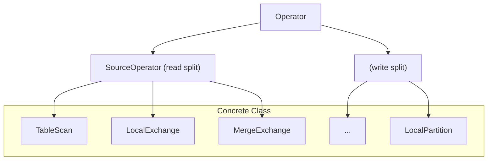
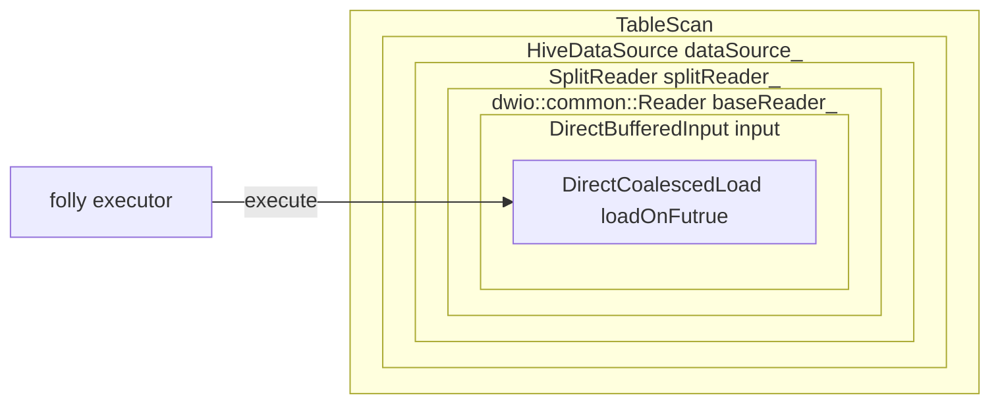
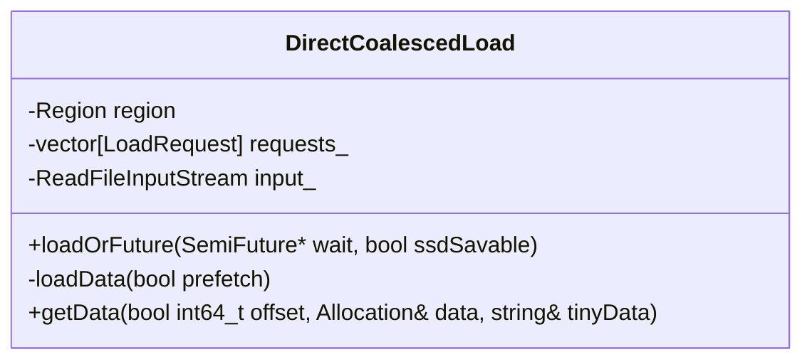
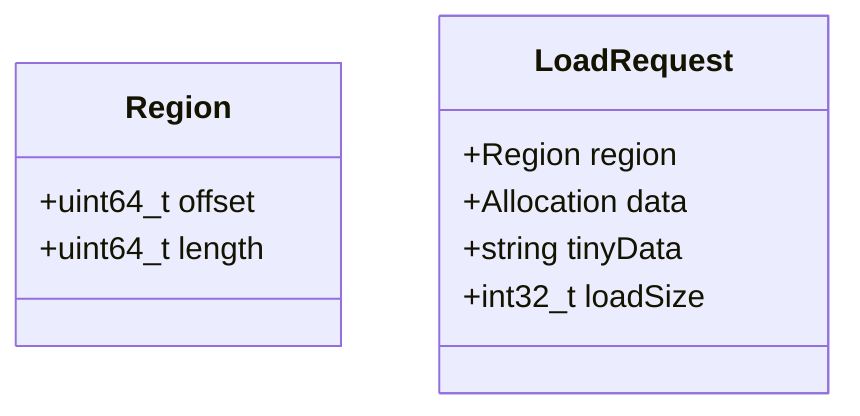

## ⚡️📥 Velox TableScan 算子的预取（Prefetch）机制

在 [Meta Velox](https://velox-lib.io/) 中，Source Operator 负责从数据源读取数据。🧰
TableScan 就是其中一种 Source Operator，它的核心职责是读取数据 split。📦
除了 TableScan，常用于 shuffle read 的 `LocalExchange` 也是一种 Source Operator。🔄



本文聚焦 TableScan 的预取优化。
通过该优化，在主线程读取数据的同时，会把后续将要读取的数据文件提前缓存到内存中，从而显著提升执行效率。

### 🧵⚙️ 使用 Folly Executor 做异步预取

TableScan 使用 Folly executor 执行异步预取操作。
因此要启用预取，在注册 Hive connector 时需要提供一个 Folly executor 对象。
例如，Gluten 的如下代码片段演示了如何在初始化 Velox backend 时开启预取支持：

```c++
  if (ioThreads > 0) {
    ioExecutor_ = std::make_unique<folly::IOThreadPoolExecutor>(ioThreads);
  }
  velox::connector::registerConnector(
    std::make_shared<velox::connector::hive::HiveConnector>(
      kHiveConnectorId,
      std::make_shared<facebook::velox::config::ConfigBase>(
        std::move(connectorConfMap)),
        ioExecutor_.get())
  );
```

Folly executor 会沿着 TableScan 的调用链一路向下传递，直到真正用到它的地方。如下所示：

- TableScan 持有成员 `dataSource_`
- HiveDataSource 持有成员 `splitReader_`
- SplitReader 持有成员 `baseReader_`
- BaseReader 持有成员 `DirectBufferedInput input_`
- DirectBufferedInput 持有成员 `DirectCoalescedLoad coalescedLoads_`（一个 list）
- 最终在 `DirectCoalescedLoad` 内部，通过 `loadOnFuture` 执行异步读

这条 ownership 链保证了 folly executor 能在最底层（真正发生数据加载的地方）被拿到并用于异步预取。



上面的说明主要帮助你定位：TableScan 的执行过程中，预取大致发生在什么位置，以及它确实通过 folly executor 做异步预取。
更多细节会在后续章节展开。

### 🧱🧠 Allocation 结构

TableScan 从文件读取数据后，数据会被存放在 Velox 的 Allocation 结构中。

Allocation 负责管理大块且非连续的内存。
它包含多个 PageRun 对象，每个 PageRun 表示一段连续的内存页，并记录该段的起始地址与页数。

在 Velox 中，Allocation 的内存通过 memory pool 的 `allocateNonContiguous` 方法来分配。
该函数会分配多段非连续内存页，并把它们组织成 PageRuns 列表，以用于后续的数据读写。

```c++

class Allocation {
  class PageRun {
    template <typename T = uint8_t>
    T* data() const;
    MachinePageCount numPages() const;
    uint64_t numBytes() const {
      return numPages() * AllocationTraits::kPageSize;
    }
  }

  ...
    
  PageRun runAt(int32_t index) const {
    return runs_[index];
  }
  
  MemoryPool* pool_{nullptr};
  std::vector<PageRun> runs_;
  int32_t numPages_ = 0;
};
```

### 🧩📋 DirectCoalescedLoad 与 LoadRequest



`DirectCoalescedLoad` 用于数据加载，它有两个重要的 public 方法：`loadOrFuture` 与 `getData`。

- `loadOrFuture`：生产数据
- `getData`：消费数据



`LoadRequest` 是数据加载过程中的一个数据结构。
其中 `data` 字段是一个 Allocation 结构 `data`，它可以通过 memory pool 分配大块内存。

在一次 load 操作中，多个 `LoadRequest` 会对应于被加载文件的不同 shard。

### 🏗️📥 `loadData` 函数

`loadOnFuture` 的底层实现会调用 `loadData`，其主要逻辑如下：

1. 对每个 request，根据其 region 分配 `tinyData` 或 `data` 的空间，并决定 `loadSize`。
2. 构造一个 buffers 数组（`vector<Range<char*>>`）。注意 buffers 本身并不分配内存；它引用的内存块实际上来自每个 request 的 `tinyData` 或 `data`。从抽象角度看，buffers 是对 small/large 两种数据载体的一层统一封装。
3. 调用 `ReadFileInputStream input_` 的 read 接口从文件读取数据，数据会被写入 request 的 `data` 或 `tinyData`。

```c++
std::vector<cache::CachePin> DirectCoalescedLoad::loadData(bool prefetch) {
  std::vector<folly::Range<char*>> buffers;
  int64_t lastEnd = requests_[0].region.offset;
  int64_t size = 0;
  int64_t overread = 0;

  for (auto& request : requests_) {
    const auto& region = request.region;
    if (region.offset > lastEnd) {
      buffers.push_back(
          folly::Range<char*>(nullptr,
              reinterpret_cast<char*>(static_cast<uint64_t>(region.offset - lastEnd))));
      overread += buffers.back().size();
    }

    if (region.length > DirectBufferedInput::kTinySize) {
	  // Code block handling large data requests
    } else {
      // Code block handling small data requests
    }
    lastEnd = region.offset + request.loadSize;
    size += request.loadSize;
  }

  input_->read(buffers, requests_[0].region.offset, LogType::FILE);
  ioStats_->xxx;
  return {};
}
```

small data request 的逻辑比较直接：数据会被直接分配在 `std::string tinyData` 的内部 buffer 里。

```c++
      request.loadSize = region.length;
      request.tinyData.resize(region.length);
      buffers.push_back(folly::Range(request.tinyData.data(), region.length));
```

large data request 的逻辑如下：先计算 load size，然后计算需要的 page 数，最后调用 `appendRanges` 往 buffer 中插入多个 Range。

```c++
      if (&request != &requests_.back()) {  // Not last request
        request.loadSize = region.length;
      } else {  // for the finalrequest, at most loadQuantum_ bytes are read.
        request.loadSize = std::min<int32_t>(region.length, loadQuantum_);
      }
      const auto numPages =
          memory::AllocationTraits::numPages(request.loadSize);
      pool_->allocateNonContiguous(numPages, request.data);
      
      appendRanges(request.data, request.loadSize, buffers);
```

在 `appendRanges` 内部，函数会为 data 里的每个 PageRun 计算实际的 readSize，并按需把 Range 插入到 buffer。

```c++
void appendRanges(
    memory::Allocation& allocation,
    size_t length,
    std::vector<folly::Range<char*>>& buffers) {
  uint64_t offsetInRuns = 0;
  for (int i = 0; i < allocation.numRuns(); ++i) {
    auto run = allocation.runAt(i);
    const uint64_t bytes = memory::AllocationTraits::pageBytes(run.numPages());
    const uint64_t readSize = std::min(bytes, length - offsetInRuns);
    buffers.push_back(folly::Range<char*>(run.data<char>(), readSize));
    offsetInRuns += readSize;
  }
}
```

### 🔍📤 `getData` 函数

因为 requests 的 offset 单调递增，所以可以用二分查找按 offset 高效定位对应的数据块。

```cpp
int32_t DirectCoalescedLoad::getData(
    int64_t offset,
    memory::Allocation& data,
    std::string& tinyData) {
  auto it = std::lower_bound(
      requests_.begin(), requests_.end(), offset, [](auto& x, auto offset) {
        return x.region.offset < offset;
      });
  if (it == requests_.end() || it->region.offset != offset) {
    return 0;
  }
  data = std::move(it->data);
  tinyData = std::move(it->tinyData);
  return it->loadSize;
}
```

### 🧵⏩ 触发异步 `loadData` 读取

一次 TableScan 会读取多个文件，每个文件又会被拆分为多个 load。
所有这些 load 会被提交到 Folly executor 中异步执行。

```cpp
  if (prefetch && executor_) {
    for (auto i = 0; i < coalescedLoads_.size(); ++i) {
      auto& load = coalescedLoads_[i];
      if (load->state() == CoalescedLoad::State::kPlanned) {
        AsyncLoadHolder loadHolder{.load = load};
        executor_->add([asyncLoad = std::move(loadHolder)]() {
          process::TraceContext trace("Read Ahead");
          VELOX_CHECK_NOT_NULL(asyncLoad.load);
          asyncLoad.load->loadOrFuture(nullptr);
        });
      }
    }
  }
```

当需要新的数据 batch 且之前加载的 splits 已经消耗完毕时，会触发 `addSplit`。
经过一系列准备步骤后，`loadData` 会在 `readRegions` 内部被异步执行。

```c++
#1  facebook::velox::dwio::common::DirectBufferedInput::readRegions
#2  facebook::velox::dwio::common::DirectBufferedInput::load
#3  facebook::velox::parquet::StructColumnReader::loadRowGroup
#4  facebook::velox::parquet::ReaderBase::scheduleRowGroups
...
#6  facebook::velox::parquet::ParquetRowReader::ParquetRowReader
#7  facebook::velox::parquet::ParquetReader::createRowReader
...
#10 facebook::velox::connector::hive::HiveDataSource::addSplit
#11 facebook::velox::exec::TableScan::getOutput()
...
#13 facebook::velox::exec::Driver::runInternal
#14 facebook::velox::exec::Driver::next
#15 facebook::velox::exec::Task::next
#16 gluten::WholeStageResultIterator::next()
#17 Java_org_apache_gluten_vectorized_ColumnarBatchOutIterator_nativeHasNext
```

### ⏳🧯 避免过早消费（Premature Consumption）

由于数据是异步加载的，因此需要保证在消费前数据已经可用。
这通常通过 state 管理以及 SemiFuture 来实现。

在 Velox 中，TableScan 的输出函数是 `getOutput`，最终会产出一个 columnar batch。
在取数据前，会调用 `loadOrFuture` 来确保同一份数据只会被加载一次。
`loadOrFuture` 内部使用 mutex 与 `state_` 做并发控制：

- 多线程并发访问时，只有第一个在 state 为 "Planned" 的线程会真正触发数据加载并执行加载逻辑。
- 其他线程如果发现 state 为 "Loading"，不会重复发起 load。
  - 若调用方传入了 `folly::SemiFuture` 指针，`loadOrFuture` 会把一个 SemiFuture 赋值给它，使得调用方可以异步等待加载完成。
  - 若没有传入指针，函数会直接返回当前状态（若加载未完成则返回 false）。

```cpp
bool CoalescedLoad::loadOrFuture(folly::SemiFuture<bool>* wait) {
  {
    std::lock_guard<std::mutex> l(mutex_);
    if (state_ == State::kCancelled || state_ == State::kLoaded) {
      return true;
    }
    if (state_ == State::kLoading) {
      if (wait == nullptr) {
        return false;
      }
      if (promise_ == nullptr) {
        promise_ = std::make_unique<folly::SharedPromise<bool>>();
      }
      *wait = promise_->getSemiFuture();
      return false;
    }

    VELOX_CHECK_EQ(State::kPlanned, state_);
    state_ = State::kLoading;
  }

  // Outside of 'mutex_'.
	....
}
```

### 🛡️🧠 避免异步线程导致的内存泄漏

在异步预取过程中，会从 memory pool 分配内存。
如果 task 被中断，需要在退出 task 前等待 Folly executor 中所有异步任务完成；
否则可能出现由于内存分配尚未结束而导致的内存泄漏。
我已经向社区提交了包含该逻辑的 [PR](https://github.com/facebookincubator/velox/pull/14722)。

### 🔗📎 References

- [velox TableScan 的预取实现](https://zhuanlan.zhihu.com/p/661962803)
- [Velox doc about TableScan](https://facebookincubator.github.io/velox/develop/operators.html#tablescannode)

