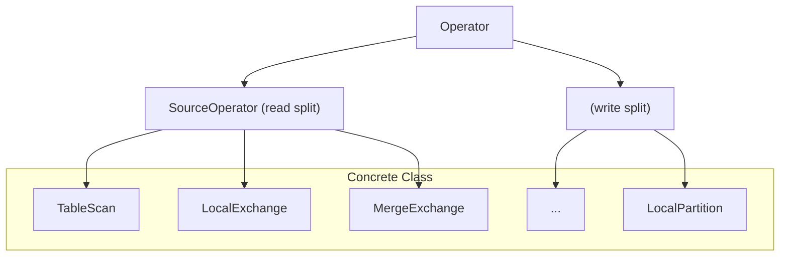
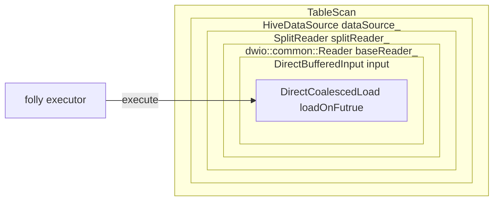
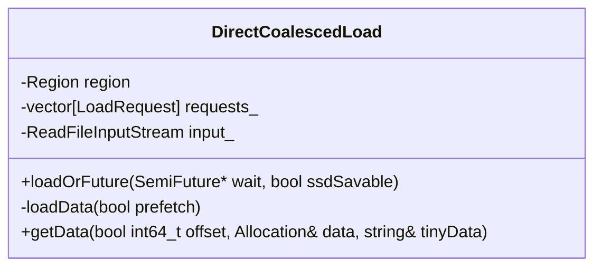
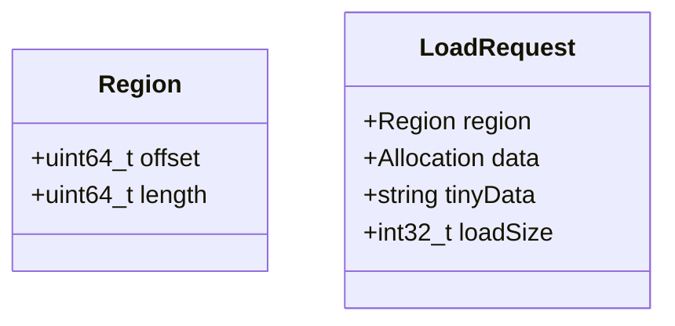

## Prefetching for the Velox Table Scan Operator

In [Meta Velox](https://velox-lib.io/), a Source Operator is responsible for reading from data sources. 
The TableScan operator is one such Source Operator, whose main function is to read data splits. 
In addition to TableScan, the `LocalExchange` operator, which is used for shuffle reads, 
is also a Source Operator.



This article will focus on the prefetching optimization for the TableScan operator.
With this optimization, data files are pre-cached into memory while the main thread reads them, which significantly improves execution efficiency.

### Prefetching with Folly Executor

The Folly executor is used by the TableScan operator to perform asynchronous prefetch operations.
Therefore, to enable prefetching, a Folly executor object must be provided when registering the Hive connector.
For example, the following code snippet from Gluten demonstrates how the Velox backend is initialized with prefetching support:

```c++
  if (ioThreads > 0) {
    ioExecutor_ = std::make_unique<folly::IOThreadPoolExecutor>(ioThreads);
  }
  velox::connector::registerConnector(
    std::make_shared<velox::connector::hive::HiveConnector>(
      kHiveConnectorId,
      std::make_shared<facebook::velox::config::ConfigBase>(
        std::move(connectorConfMap)),
        ioExecutor_.get())
  );
```

Folly executor is passed along from the TableScan operator all the way to where it is actually used. As shown below:

- TableScan contains the member `dataSource_`
- HiveDataSource contains the member `splitReader_`
- SplitReader contains the member `baseReader_`
- BaseReader contains the member `DirectBufferedInput input_`
- DirectBufferedInput contains the member `DirectCoalescedLoad coalescedLoads_` (a list)
- Finally, inside `DirectCoalescedLoad`, the asynchronous read is executed via the method loadOnFuture

This chain of ownership ensures the folly executor is available and used for asynchronous prefetching at the lowest layer where actual data loading occurs.



The above explanation only illustrates the general location of the prefetching process during the execution of the TableScan operator,
as well as the fact that it utilizes a folly executor for asynchronous prefetching. More details will be provided later in this article.

### Allocation Structure


After TableScan reads data from files, the data is stored in Velox's Allocation structure.

Allocation is responsible for managing large, non-contiguous memory blocks.
It contains multiple PageRun objects, each representing a segment of continuous memory pages,
and stores the start address and the number of pages for that segment.

In Velox, the memory for an Allocation object is allocated through the memory pool's allocateNonContiguous method.
This function allocates multiple non-contiguous memory pages and organizes them into a list of PageRuns for subsequent data read and write operations.


```c++

class Allocation {
  class PageRun {
    template <typename T = uint8_t>
    T* data() const;
    MachinePageCount numPages() const;
    uint64_t numBytes() const {
      return numPages() * AllocationTraits::kPageSize;
    }
  }

  ...
    
  PageRun runAt(int32_t index) const {
    return runs_[index];
  }
  
  MemoryPool* pool_{nullptr};
  std::vector<PageRun> runs_;
  int32_t numPages_ = 0;
};
```

### DirectCoalescedLoad and LoadRequest



The DirectCoalescedLoad object is used for data loading. It has two important public functions: `loadOrFuture` and `getData`.

The `loadOrFuture` function produces data, while `getData` consumes data.



`LoadRequest` is a data structure used during the data loading process.
Its data field contains a Allocation structure `data`, which enables the allocation of large amounts of memory via the memory pool.

Within a single load operation, multiple `LoadRequest` instances correspond to different shards of the file being loaded.

### loadData Function

The underlying implementation of the loadOnFuture function calls loadData, which mainly performs the following logic:

1. For each request to be loaded, it allocates space for either tinyData or data based on the request's region and determines the size of loadSize.
2. It constructs a buffers array `(vector<Range<char*>>)`. The buffers array itself does not allocate memory; rather, the memory blocks it references are actually tinyData or data in each request. Essentially, buffers serves as a unified abstraction over both dataType and data.
3. It calls the read interface of the ReadFileInputStream input_ to read data from the file, with the data being loaded into data or tinyData fields in the request.


```c++
std::vector<cache::CachePin> DirectCoalescedLoad::loadData(bool prefetch) {
  std::vector<folly::Range<char*>> buffers;
  int64_t lastEnd = requests_[0].region.offset;
  int64_t size = 0;
  int64_t overread = 0;

  for (auto& request : requests_) {
    const auto& region = request.region;
    if (region.offset > lastEnd) {
      buffers.push_back(
          folly::Range<char*>(nullptr,
              reinterpret_cast<char*>(static_cast<uint64_t>(region.offset - lastEnd))));
      overread += buffers.back().size();
    }

    if (region.length > DirectBufferedInput::kTinySize) {
	  // Code block handling large data requests
    } else {
      // Code block handling small data requests
    }
    lastEnd = region.offset + request.loadSize;
    size += request.loadSize;
  }

  input_->read(buffers, requests_[0].region.offset, LogType::FILE);
  ioStats_->xxx;
  return {};
}
```

The logic for small data requests is relatively straightforward: the data is allocated directly within the internal buffer of `std::string tinyData`.


```c++
      request.loadSize = region.length;
      request.tinyData.resize(region.length);
      buffers.push_back(folly::Range(request.tinyData.data(), region.length));
```

The code block for large data requests works as follows: it first calculates the load size, then determines the required number of pages, and finally calls appendRanges to insert multiple Range objects into the buffer.

```c++
      if (&request != &requests_.back()) {  // Not last request
        request.loadSize = region.length;
      } else {  // for the finalrequest, at most loadQuantum_ bytes are read.
        request.loadSize = std::min<int32_t>(region.length, loadQuantum_);
      }
      const auto numPages =
          memory::AllocationTraits::numPages(request.loadSize);
      pool_->allocateNonContiguous(numPages, request.data);
      
      appendRanges(request.data, request.loadSize, buffers);
```

Within `appendRanges`, the function calculates the actual readSize for each run in the PageRun array of data, and inserts Range objects into the buffer accordingly.

```c++
void appendRanges(
    memory::Allocation& allocation,
    size_t length,
    std::vector<folly::Range<char*>>& buffers) {
  uint64_t offsetInRuns = 0;
  for (int i = 0; i < allocation.numRuns(); ++i) {
    auto run = allocation.runAt(i);
    const uint64_t bytes = memory::AllocationTraits::pageBytes(run.numPages());
    const uint64_t readSize = std::min(bytes, length - offsetInRuns);
    buffers.push_back(folly::Range<char*>(run.data<char>(), readSize));
    offsetInRuns += readSize;
  }
}
```

### getData Function

Because the offset values in the requests are monotonically increasing, a binary search can be used to efficiently locate the corresponding data block by offset.

```cpp
int32_t DirectCoalescedLoad::getData(
    int64_t offset,
    memory::Allocation& data,
    std::string& tinyData) {
  auto it = std::lower_bound(
      requests_.begin(), requests_.end(), offset, [](auto& x, auto offset) {
        return x.region.offset < offset;
      });
  if (it == requests_.end() || it->region.offset != offset) {
    return 0;
  }
  data = std::move(it->data);
  tinyData = std::move(it->tinyData);
  return it->loadSize;
}
```

### Triggering Asynchronous loadData Reads

A TableScan reads data from multiple files, with each file further split into multiple loads.
All of these loads are submitted to the Folly executor to be executed asynchronously.

```cpp
  if (prefetch && executor_) {
    for (auto i = 0; i < coalescedLoads_.size(); ++i) {
      auto& load = coalescedLoads_[i];
      if (load->state() == CoalescedLoad::State::kPlanned) {
        AsyncLoadHolder loadHolder{.load = load};
        executor_->add([asyncLoad = std::move(loadHolder)]() {
          process::TraceContext trace("Read Ahead");
          VELOX_CHECK_NOT_NULL(asyncLoad.load);
          asyncLoad.load->loadOrFuture(nullptr);
        });
      }
    }
  }
```

When a new batch of data is needed and all previously loaded splits have been exhausted, an addSplit operation is triggered.
After a series of preparation steps, the loadData function is executed asynchronously within the readRegions function.

```c++
#1  facebook::velox::dwio::common::DirectBufferedInput::readRegions
#2  facebook::velox::dwio::common::DirectBufferedInput::load
#3  facebook::velox::parquet::StructColumnReader::loadRowGroup
#4  facebook::velox::parquet::ReaderBase::scheduleRowGroups
...
#6  facebook::velox::parquet::ParquetRowReader::ParquetRowReader
#7  facebook::velox::parquet::ParquetReader::createRowReader
...
#10 facebook::velox::connector::hive::HiveDataSource::addSplit
#11 facebook::velox::exec::TableScan::getOutput()
...
#13 facebook::velox::exec::Driver::runInternal
#14 facebook::velox::exec::Driver::next
#15 facebook::velox::exec::Task::next
#16 gluten::WholeStageResultIterator::next()
#17 Java_org_apache_gluten_vectorized_ColumnarBatchOutIterator_nativeHasNext
```

### Avoiding Premature Consumption

Since data is loaded asynchronously, it is necessary to ensure that data is available before consumption. This is achieved through state management and the use of SemiFuture.

In Velox, the output function of the TableScan operator is getOutput, which ultimately obtains a columnar batch.
Before fetching data, the loadOrFuture function is called to ensure that data is loaded only once.
Internally, this function uses a mutex and a `state_` variable for concurrency control:

- When multiple threads access this function concurrently, only the first thread that enters while the state is "Planned" will actually trigger data loading and execute the loading logic.
- Other concurrent threads, if they find the state is "Loading", will not initiate another load. If a `folly::SemiFuture` pointer is provided by the caller, loadOrFuture will assign a SemiFuture object to it, allowing the caller to asynchronously wait for the data load to finish. If no pointer is provided, the function simply returns the current state (returning false if loading is incomplete).

```cpp
bool CoalescedLoad::loadOrFuture(folly::SemiFuture<bool>* wait) {
  {
    std::lock_guard<std::mutex> l(mutex_);
    if (state_ == State::kCancelled || state_ == State::kLoaded) {
      return true;
    }
    if (state_ == State::kLoading) {
      if (wait == nullptr) {
        return false;
      }
      if (promise_ == nullptr) {
        promise_ = std::make_unique<folly::SharedPromise<bool>>();
      }
      *wait = promise_->getSemiFuture();
      return false;
    }

    VELOX_CHECK_EQ(State::kPlanned, state_);
    state_ = State::kLoading;
  }

  // Outside of 'mutex_'.
	....
}
```

### Preventing Memory Leaks Caused by Asynchronous Threads
During asynchronous prefetch operations, memory is allocated from the memory pool.
If a task is interrupted, it is necessary to wait until all asynchronous tasks in the Folly executor finish before exiting the task;
this avoids memory leaks caused by unfinished memory allocations.
I have submitted a [PR](https://github.com/facebookincubator/velox/pull/14722) with this logic to the community. 

### References
- [velox TableScan 的预取实现](https://zhuanlan.zhihu.com/p/661962803)
- [Velox doc about TableScan](https://facebookincubator.github.io/velox/develop/operators.html#tablescannode)


